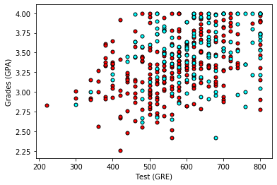

## Predicting student admissions using Keras

In this notebook, student admissions is predicted with neural networks in [Keras](https://pypi.org/project/Keras/). The students admissions to graduate school at UCLA is based on three pieces of data:

* GRE Scores (Test)
* GPA Scores (Grades)
* Class rank (1-4)



### Data

The dataset originally came from here: http://www.ats.ucla.edu/. The small dataset has total 400 entries, each having 4 columns: admit, gre, gpa, rank.

### Softwares and libraries
* [Python 3](www.python.org)
* [Jupyter Notebook](http://ipython.org/notebook.html)
* [NumPy](https://pypi.org/project/numpy/)
* [Matplotlib](https://pypi.org/project/matplotlib/)
* [Keras](https://pypi.org/project/Keras/)

### Getting the project files
1. Clone the repository and navigate to the downloaded folder.

```
git clone https://github.com/adityasaxena26/predicting-students-admissions-keras.git
cd predicting-students-admissions-keras
```
2. Run the following to open up the Jupyter notebook server:
`jupyter notebook`

3. In the browser, open the notebook ```students_admissions_keras.ipynb```
